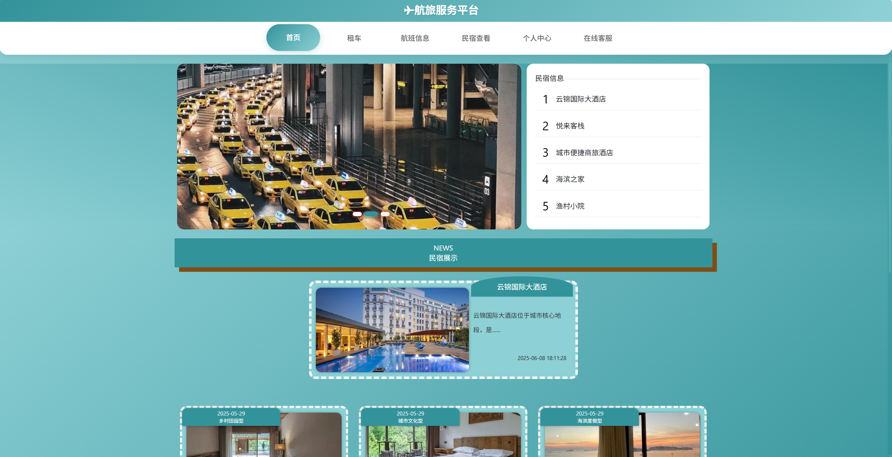

# 航旅服务平台 (ATSP - Air Travel Service Platform)

## 🛫 项目简介

航旅服务平台（ATSP）是一个基于Spring Boot + Vue.js的现代化航空订票平台，提供航班查询、在线预订、民宿预订、租车服务等一站式旅游服务解决方案。系统采用前后端分离架构，具有用户端和管理端双重界面，为用户提供便捷的航空出行服务。

## ✨ 主要特性

### 🎯 核心功能
- **🛫 航班信息管理** - 航班查询、预订、收藏
- **🏠 民宿预订服务** - 民宿展示、详情查看、预订管理
- **🚗 租车服务** - 车辆信息发布与预订
- **💬 在线客服** - 实时聊天客服系统
- **👤 用户管理** - 注册、登录、个人中心
- **📊 后台管理** - 完整的管理员后台系统

### 🎨 界面特色
- **现代化UI设计** - 圆角卡片、渐变背景、动画效果
- **响应式布局** - 支持多种设备屏幕
- **交互体验** - 流畅的动画过渡效果
- **主题化设计** - 统一的色彩搭配

## 🛠 技术栈

### 后端技术
- **Java 1.8** - 核心开发语言
- **Spring Boot 2.2.2** - 应用框架
- **MyBatis Plus 2.3** - ORM框架
- **MySQL** - 数据库
- **Apache Shiro** - 安全框架
- **Maven** - 项目管理工具

### 前端技术
- **Vue.js 2.x** - 前端框架
- **Element UI** - 管理端UI组件库
- **Layui** - 用户端UI框架
- **jQuery** - JavaScript库
- **Bootstrap** - CSS框架
- **HTML5/CSS3/JavaScript** - 基础技术

### 开发工具
- **FastJson** - JSON处理
- **Apache POI** - Excel处理
- **百度AI SDK** - 人工智能服务
- **Hutool** - Java工具包

## 📁 项目结构

```
ATSP/
├── src/main/java/com/           # Java源码
│   ├── annotation/              # 注解
│   ├── config/                  # 配置类
│   ├── controller/              # 控制器
│   ├── dao/                     # 数据访问层
│   ├── entity/                  # 实体类
│   ├── interceptor/             # 拦截器
│   ├── service/                 # 服务层
│   ├── utils/                   # 工具类
│   └── [主启动类].java          # Spring Boot启动类
├── src/main/resources/          # 资源文件
│   ├── admin/admin/             # 管理端前端（Vue.js）
│   │   ├── src/                 # Vue源码
│   │   │   ├── components/      # 组件
│   │   │   ├── views/           # 页面视图
│   │   │   ├── router/          # 路由配置
│   │   │   ├── utils/           # 工具类
│   │   │   └── App.vue          # 根组件
│   │   ├── public/              # 公共资源
│   │   ├── package.json         # 依赖配置
│   │   ├── vue.config.js        # Vue配置
│   │   ├── 1-install.bat        # Windows安装脚本
│   │   ├── 2-run.bat            # Windows运行脚本
│   │   └── 3-build.bat          # Windows构建脚本
│   ├── front/front/             # 用户端前端（jQuery + Vue.js）
│   │   ├── css/                 # 样式文件
│   │   ├── js/                  # JavaScript文件
│   │   ├── pages/               # 页面文件
│   │   │   ├── home/            # 首页
│   │   │   ├── jipiao/          # 航班信息
│   │   │   ├── jipiaoOrder/     # 机票预订
│   │   │   ├── jipiaoCollection/ # 航班收藏
│   │   │   ├── news/            # 民宿信息
│   │   │   ├── forum/           # 租车服务
│   │   │   ├── chat/            # 在线客服
│   │   │   ├── login/           # 登录注册
│   │   │   └── yonghu/          # 用户中心
│   │   └── index.html           # 主入口
│   ├── mapper/                  # MyBatis映射文件
│   ├── static/                  # 静态资源
│   └── application.yml          # 应用配置
├── mhwangshangdingpiao.sql      # 数据库结构和数据文件
├── pom.xml                      # Maven配置
├── .gitignore                   # Git忽略文件配置
└── README.md                    # 项目说明文档
```

## 🚀 快速开始

### 环境要求

确保您的开发环境满足以下要求：

**后端环境：**
- **Java JDK 1.8+** 
- **MySQL 5.7+** 或 **MySQL 8.0+**
- **Maven 3.6+**
- **IDE**: IntelliJ IDEA / Eclipse（推荐IDEA）

**前端环境（管理端）：**
- **Node.js 12.0+** （推荐使用LTS版本，注意不要超过14版本，13最适合）
- **npm 6.0+** 或 **cnpm** 或 **yarn**
- **Vue CLI 4.0+** （可选，用于全局命令）

### 安装步骤

#### 1. 克隆项目
```bash
git clone [git@github.com:Babapei/ATSP.git]
cd ATSP
```

#### 2. 数据库配置

**创建数据库：**
```sql
CREATE DATABASE mhwangshangdingpiao DEFAULT CHARACTER SET utf8mb4 COLLATE utf8mb4_unicode_ci;
```

**导入数据库结构和数据：**
```bash
# 导入项目根目录下的SQL文件
mysql -u root -p mhwangshangdingpiao < mhwangshangdingpiao.sql
```

**修改数据库连接：**
编辑 `src/main/resources/application.yml` 文件：
```yaml
spring:
  datasource:
    url: jdbc:mysql://127.0.0.1:3306/mhwangshangdingpiao?useUnicode=true&characterEncoding=utf-8&useJDBCCompliantTimezoneShift=true&useLegacyDatetimeCode=false&serverTimezone=GMT%2B8&useSSL=false
    username: your_username    # 修改为您的数据库用户名
    password: your_password    # 修改为您的数据库密码
```

#### 3. 导入项目依赖
```bash
mvn clean install
```

#### 4. 启动后端服务
```bash
mvn spring-boot:run
```

或者在IDE中直接运行主启动类
<font color="green">将upload.zip解压缩去替换ATSP\target\classes\static\upload，这里面有对应的现目前的所有照片（不这样做的话没法显示照片）</font>

#### 5. 配置并启动Vue前端（管理端）

**进入Vue项目目录：**
```bash
cd src/main/resources/admin/admin
```

**安装Node.js依赖：**
```bash
# 推荐使用cnpm（速度更快）
cnpm install

# 或者使用npm
npm install

# 或者使用yarn
yarn install
```

**启动Vue开发服务器：**
```bash
# 使用cnpm
cnpm run serve

# 或者使用npm
npm run serve

# 或者使用yarn
yarn serve
```

**构建生产版本（可选）：**
```bash
# 构建用于生产环境的版本
cnpm run build
```

**Windows用户快捷方式：**
项目提供了Windows批处理文件，可以直接双击运行：
- `1-install.bat` - 安装依赖
- `2-run.bat` - 启动开发服务器  
- `3-build.bat` - 构建生产版本

### 访问地址

项目启动成功后，可以通过以下地址访问：

- **用户端首页**: http://localhost:8080/mhwangshangdingpiao/front/index.html
- eg.用户名：c 密码：1
- **管理员后台（开发模式）**: http://localhost:8081/#/login
- eg.用户名：admin 密码：admin
- **管理员后台（生产模式）**: http://localhost:8080/mhwangshangdingpiao/admin/dist/index.html

## 📋 功能模块详解

### 👤 用户端功能

#### 🏠 首页模块
- 轮播图展示
- 民宿信息展示
- 航班信息展示
- 现代化卡片设计，支持圆角和动画效果

#### ✈️ 航班管理
- **航班查询**: 根据出发地、目的地、时间查询航班
- **航班详情**: 查看航班详细信息、价格、座位
- **航班收藏**: 收藏喜欢的航班信息
- **在线预订**: 选择座位、填写乘客信息、支付

#### 🏨 民宿服务
- **民宿浏览**: 分类浏览民宿信息
- **详情查看**: 查看民宿详细介绍、图片、价格
- **圆角卡片设计**: 现代化的展示界面

#### 🚗 租车服务
- **车辆信息**: 浏览可租赁车辆
- **租车预订**: 在线预订租车服务

#### 💬 在线客服
- **实时聊天**: 与客服人员实时沟通
- **圆角弹窗**: 美观的对话界面

#### 👨‍💼 个人中心
- **个人信息管理**: 修改个人资料
- **订单管理**: 查看历史订单
- **收藏管理**: 管理收藏的航班

### 🔧 管理端功能

- **用户管理**: 用户信息的增删改查
- **航班管理**: 航班信息的发布和管理
- **订单管理**: 订单的处理和跟踪
- **民宿管理**: 民宿信息的维护
- **系统设置**: 轮播图、系统参数配置

## ⚙️ 配置说明

### 数据库配置
```yaml
# application.yml
spring:
  datasource:
    driverClassName: com.mysql.cj.jdbc.Driver
    url: jdbc:mysql://127.0.0.1:3306/mhwangshangdingpiao
    username: root
    password: your_password
```

### 服务器配置
```yaml
server:
  port: 8080                    # 服务端口
  servlet:
    context-path: /mhwangshangdingpiao  # 项目访问路径
```

### 文件上传配置
```yaml
spring:
  servlet:
    multipart:
      max-file-size: 1000MB     # 最大文件大小
      max-request-size: 1000MB  # 最大请求大小
```

### Vue前端配置

**开发环境配置 (vue.config.js)：**
```javascript
module.exports = {
  devServer: {
    host: "0.0.0.0",
    port: 8081,              // Vue开发服务器端口
    hot: true,
    https: false,
    proxy: {
      '/mhwangshangdingpiao': {
        target: 'http://localhost:8080/mhwangshangdingpiao/',
        changeOrigin: true,
        secure: false,
        pathRewrite: {
          '^/mhwangshangdingpiao': ''
        }
      }
    }
  }
}
```

**依赖管理 (package.json 主要依赖)：**
```json
{
  "dependencies": {
    "vue": "^2.6.10",
    "element-ui": "^2.15.10",
    "axios": "^0.19.2",
    "vue-router": "^3.1.5",
    "echarts": "^4.6.0"
  }
}
```

## 🔧 开发说明

### 代码规范
- 使用驼峰命名法
- 类名首字母大写
- 方法名和变量名首字母小写
- 常量全大写，单词间用下划线分隔

### 数据库表命名规范
- 表名使用小写字母，单词间用下划线分隔
- 主键统一使用 `id`
- 外键使用 `表名_id` 格式
- 逻辑删除字段统一使用相关字段

### API接口规范
- 统一返回JSON格式
- 使用RESTful风格
- 统一异常处理
- 接口文档使用注释说明

## 🚨 注意事项

### 环境配置
1. **JDK版本**: 必须使用JDK 1.8，其他版本可能导致兼容性问题
2. **MySQL版本**: 推荐使用MySQL 5.7+，注意字符集设置为utf8mb4
3. **Maven版本**: 使用Maven 3.6+，确保依赖正常下载
4. **Node.js版本**: 推荐使用Node.js 12.0+的LTS版本
5. **包管理器**: 推荐使用cnpm（国内速度更快）或yarn

### 数据库注意事项
1. **字符集**: 数据库和表都要设置为utf8mb4字符集
2. **时区**: 注意MySQL时区设置，建议设置为 `GMT+8`
3. **连接池**: 生产环境建议配置连接池参数

### 部署注意事项
1. **端口冲突**: 确保8080端口未被占用
2. **文件路径**: 注意文件上传路径的权限设置
3. **日志配置**: 生产环境建议配置日志级别和输出路径

### 安全注意事项
1. **数据库密码**: 生产环境务必修改默认数据库密码
2. **文件上传**: 限制上传文件类型和大小
3. **SQL注入**: 使用MyBatis参数化查询防止SQL注入

## 🐛 常见问题

### Q1: 项目启动失败，提示数据库连接错误
**A1**: 检查以下几点：
- MySQL服务是否启动
- 数据库用户名密码是否正确
- 数据库是否存在
- 网络连接是否正常

### Q2: 前端页面显示异常或样式错误
**A2**: 可能的解决方案：
- 清除浏览器缓存
- 检查静态资源路径是否正确
- 确认CSS/JS文件是否加载成功

### Q3: 文件上传失败
**A3**: 检查：
- 上传文件大小是否超出限制
- 上传目录是否有写权限
- 文件类型是否被允许

### Q4: 管理员后台无法访问
**A4**: 确认：
- 项目是否正常启动
- 访问路径是否正确
- 防火墙是否开放对应端口

### Q5: Vue前端启动失败
**A5**: 检查以下几点：
- Node.js版本是否符合要求（推荐12.0-14.0之间）
- 是否正确安装了依赖 `cnpm install`
- 端口8081是否被占用
- 网络是否正常（安装依赖需要网络）
- 如果使用npm较慢，建议使用cnpm或yarn

### Q6: Vue前端编译错误
**A6**: 可能的解决方案：
- 删除 `node_modules` 文件夹重新安装依赖
- 清除npm缓存：`npm cache clean --force`
- 检查Node.js和npm版本是否兼容
- 确认所有依赖都已正确安装

### Q7: 前后端接口调用失败
**A7**: 检查：
- 后端服务是否正常启动（端口8080）
- Vue代理配置是否正确
- 接口路径是否匹配
- 跨域配置是否正确

## 🤝 贡献指南

欢迎提交Issue和Pull Request来完善项目！

### 提交规范
- 提交前请先同步最新代码
- 提交信息请使用中文，简要说明修改内容
- 确保代码能够正常编译和运行

## 📄 开源协议

本项目采用 MIT 协议，详细信息请参考 LICENSE 文件。

## 📞 联系方式

如有问题或建议，请通过以下方式联系：

- **项目Issues**: 在GitHub上提交Issue
- **技术支持**: 请在项目中提交Issue或Pull Request

## 🙏 致谢

感谢以下开源项目的支持：
- Spring Boot
- Vue.js
- Element UI
- Layui
- MyBatis Plus
- 以及其他优秀的开源项目

---

**🌟 如果觉得项目对您有帮助，请给个Star支持一下！** 

